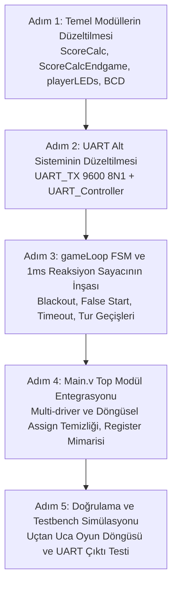

# DENETİM VE DURUM RAPORU (v2.1) — Çok Oyunculu Basys3 Refleks Oyunu

**Tarih:** 2026-08-04 (Kapsamlı Kod Tabanı ve Şartname Analizi Güncellemesi)  
**Grup:** Sade Bulutlar (Plain Clouds)  
**Hedef Donanım:** Digilent Basys3 (Xilinx Artix-7 XC7A35T-1CPG236C), 100 MHz Sistem Saati  
**Kapsam:** Tüm Verilog kaynak dosyaları, testbench, XDC kısıt dosyası ve `proje.txt` şartnamesi  

---

## 0. Genel Durum Özeti ve Modül Sağlık Tablosu

| # | Modül Adı | Kaynak Dosya | Top'a Bağlı? | Sentezlenebilirlik | Fonksiyonel Durum |
|---|-----------|--------------|:------------:|:------------------:|-------------------|
| 1 | `Main` | [1_Main.v](file:///c:/Users/Meriç/Desktop/Yeni%20dosya/265SadeBulutlarProje2026/265SadeBulutlarProje2026/1_Main.v) | — (Top) | ❌ Hatalı (Multi-driver / Tanımsız Modül) | 🔴 Kritik `assign` döngüleri ve bağlantı hataları var |
| 2 | `ConfigMenu` | [2_ConfigMenu.v](file:///c:/Users/Meriç/Desktop/Yeni%20dosya/265SadeBulutlarProje2026/265SadeBulutlarProje2026/2_ConfigMenu.v) | ✅ | 🟢 Sentezlenebilir | 🟢 Şartnameyle tam uyumlu, stabil |
| 3 | `segmentDisplay7` | [3_7segmentDisplay.v](file:///c:/Users/Meriç/Desktop/Yeni%20dosya/265SadeBulutlarProje2026/265SadeBulutlarProje2026/3_7segmentDisplay.v) | ✅ | 🟢 Sentezlenebilir | 🟢 4 saniyelik animasyon ve karartma doğru |
| 4 | `lfsr16` | [4.1_lfsr16.v](file:///c:/Users/Meriç/Desktop/Yeni%20dosya/265SadeBulutlarProje2026/265SadeBulutlarProje2026/4.1_lfsr16.v) | ✅ | 🟢 Sentezlenebilir | 🟢 Maximal-length Galois LFSR, tam doğru |
| 5 | `random_delay_gen` | [4.2_RSO.v](file:///c:/Users/Meriç/Desktop/Yeni%20dosya/265SadeBulutlarProje2026/265SadeBulutlarProje2026/4.2_RSO.v) | ✅ | 🟢 Sentezlenebilir | 🟢 3 aşamalı pipeline, gecikme sınırları doğru |
| 6 | `debounce` | [5.1_Debounce.v](file:///c:/Users/Meriç/Desktop/Yeni%20dosya/265SadeBulutlarProje2026/265SadeBulutlarProje2026/5.1_Debounce.v) | ✅ | 🟢 Sentezlenebilir | 🟢 20ms stabilite filtresi aktif |
| 7 | `TusKontrolu` | [5.2_TusKontrolu.v](file:///c:/Users/Meriç/Desktop/Yeni%20dosya/265SadeBulutlarProje2026/265SadeBulutlarProje2026/5.2_TusKontrolu.v) | ✅ | 🟢 Sentezlenebilir | 🟢 Kenar algılama (single-pulse) çalışıyor |
| 8 | `gameLoop` | [6_GameLoop.v](file:///c:/Users/Meriç/Desktop/Yeni%20dosya/265SadeBulutlarProje2026/265SadeBulutlarProje2026/6_GameLoop.v) | ✅ | ❌ Hatalı | 🔴 Reaksiyon sayacı eksik, 1 cycle'da tur bitiriyor, B/NB karışımı |
| 9 | `ScoreCalc` | [7.1_ScoreCalc.v](file:///c:/Users/Meriç/Desktop/Yeni%20dosya/265SadeBulutlarProje2026/265SadeBulutlarProje2026/7.1_ScoreCalc.v) | ✅ | ❌ Sözdizimi Hatası (`reg done <= 0;`) | 🔴 Sürekli puan ekleme döngüsü (calcDone sıfırlanmıyor) |
| 10 | `ScoreCalcEndgame` | [7.2_ScoreCalcEndgame.v](file:///c:/Users/Meriç/Desktop/Yeni%20dosya/265SadeBulutlarProje2026/265SadeBulutlarProje2026/7.2_ScoreCalcEndgame.v) | ✅ | 🟢 Sentezlenebilir | 🔴 Player 4 yoksa kilitlenme (deadlock) hatası |
| 11 | `playerLEDs` | [8.1_playerLEDs.v](file:///c:/Users/Meriç/Desktop/Yeni%20dosya/265SadeBulutlarProje2026/265SadeBulutlarProje2026/8.1_playerLEDs.v) | ✅ | 🟢 Sentezlenebilir | 🟡 `calcOver==0` iken LED'ler sönüyor (kalıcı olmalı) |
| 12 | `playerLEDsEndgame` | [8.2_playerLEDsEndgame.v](file:///c:/Users/Meriç/Desktop/Yeni%20dosya/265SadeBulutlarProje2026/265SadeBulutlarProje2026/8.2_playerLEDsEndgame.v) | ✅ | 🟢 Sentezlenebilir | 🟢 Kazanan/beraberlik LED gösterimi doğru |
| 13 | `UART_Controller` | [9.1_UartCont.v](file:///c:/Users/Meriç/Desktop/Yeni%20dosya/265SadeBulutlarProje2026/265SadeBulutlarProje2026/9.1_UartCont.v) | ✅ | 🟡 Eksik Mantık | 🔴 Mid-game tur raporlaması boş, `yuzler` undriven |
| 14 | `UART_TX` | [9.2_uart_tx.v](file:///c:/Users/Meriç/Desktop/Yeni%20dosya/265SadeBulutlarProje2026/265SadeBulutlarProje2026/9.2_uart_tx.v) | ✅ | 🟡 Protokol Hatalı | 🔴 Start bit eksik, baud sayacı çift sayıyor, 7 bit yolluyor |
| 15 | `Binary_to_BCD` | [9.3_bcd.v](file:///c:/Users/Meriç/Desktop/Yeni%20dosya/265SadeBulutlarProje2026/265SadeBulutlarProje2026/9.3_bcd.v) | ✅ | 🟢 Sentezlenebilir | 🟢 7-bit binary -> BCD (onlar, birler) doğru |
| 16 | Testbench | [4tb_nrsotb.v](file:///c:/Users/Meriç/Desktop/Yeni%20dosya/265SadeBulutlarProje2026/265SadeBulutlarProje2026/4tb_nrsotb.v) | — | 🟢 Simüle Edilebilir | 🟢 RSO ve LFSR testleri başarılı |
| 17 | Kısıt Dosyası | [0.5_basys3Assigning.xdc](file:///c:/Users/Meriç/Desktop/Yeni%20dosya/265SadeBulutlarProje2026/265SadeBulutlarProje2026/0.5_basys3Assigning.xdc) | — | 🟢 Geçerli | 🟢 Basys3 pin haritası eksiksiz |

---

## 1. Modül Bazlı Detaylı Analiz ve Tespit Edilen Hatalar

### 1.1. `Main` — [1_Main.v](file:///c:/Users/Meriç/Desktop/Yeni%20dosya/265SadeBulutlarProje2026/265SadeBulutlarProje2026/1_Main.v)
*   🔴 **Kritik Multi-Driver ve Hatalı `assign` Satırları (Satır 98-101):**
    ```verilog
    assign p1Total = p1TotalNew;
    assign p1Total = p2TotalNew;  // p1Total'e 4 farklı sinyal sürülmüş!
    assign p1Total = p3TotalNew;
    assign p1Total = p4TotalNew;
    ```
    Bu satırlar hem sözdizimi açısından `p2Total`, `p3Total`, `p4Total` yerine yanlış yazılmıştır hem de toplam skorları saklayan bir register yapısı yerine doğrudan kombinasyonel `assign` ile döngüsel bir multi-driver/latch hatası oluşturmaktadır. Toplam skorlar `Main` veya `gameLoop` içinde saat vuruşuna bağlı register dizisi olarak tutulmalıdır.
*   🔴 **Döngüsel `assign` Hataları:**
    *   `assign currentTurn = currentTurnNew;` (Satır 97)
    *   `assign playersIn = playersLeft;` (Satır 102)
    `playersIn` ve `currentTurn` aynı zamanda `ConfigMenu` ve `gameLoop` çıkışlarına bağlı olduğu için çift sürücü oluşturmaktadır.
*   🔴 **Tanımsız Sahte Modül Çağrısı (Satır 110):**
    `ThingsToDo broThinksHesPartOfTheTeam();` satırı tanımlı olmayan bir modüldür, Vivado sentezinde doğrudan `[Synth 8-2715] Module ThingsToDo not found` hatası verir.
*   🔴 **RSO Tetikleme Bağlantısı (Satır 78):**
    `random_delay_gen rso(clk, rst, center, diffMode, lfsrOut, waitTime, rsoValid);` satırında tetikleme girişi `center`'a (orta butona) bağlanmış. Oysa şartnameye göre RSO, her turun başında `gameLoop` tarafından otomatik tetiklenmelidir (`rsoTrigger`).

---

### 1.2. `gameLoop` — [6_GameLoop.v](file:///c:/Users/Meriç/Desktop/Yeni%20dosya/265SadeBulutlarProje2026/265SadeBulutlarProje2026/6_GameLoop.v)
*   🔴 **Reaksiyon Süresinin Ölçülmemesi ve 10ns'de Tur Bitirme Bug'ı (Satır 206-233):**
    `blackout` aktif olduğunda `timer` ve `timer2` döngüsünde blok parantezi (`begin...end`) eksikliği nedeniyle `timer = 0` ve `turnOver <= 1'b1` ilk saat vuruşunda (10 ns içinde) çalışmakta ve oyunculara buton basma fırsatı tanımadan turu anında bitirmektedir!
*   🔴 **Reaksiyon Süresi Çözünürlüğü:**
    Şartname *"Basamakların söndüğü an referans zamanı olarak alınmalıdır. Oyuncuların butona basma süreleri bu andan itibaren 1 ms çözünürlükle ölçülmelidir."* demektedir. Mevcut kodda 100MHz saat vuruşunu 1ms'ye (100.000 cycle) bölen ve 1ms adımında artan bir donanım sayacı yoktur.
*   🔴 **Hatalı Erken Basma (False Start) ve Zaman Aşımı (Timeout) Mantığı:**
    *   Satır 168-179 arasında her saat vuruşunda `timedOutPlayers[X] <= 1'b1;` atanmakta, oyuncu butona bassa dahi bir sonraki cycle'da tekrar `1` yapılmaktadır.
    *   Karartma öncesi rastgele bekleme süresinde (`timer <= waitTime`) butona basıldığında `falseStartPlayers[X] <= 1'b1;` yapılmalı ve o oyuncu o tur için devre dışı kalmalıdır.
    *   Karartma başladıktan sonra 5.000 ms (5 saniye) dolduğunda basmayan oyuncular `timedOutPlayers[X] <= 1'b1;` olarak işaretlenmelidir.
*   🔴 **FSM `next_state` Çift Sürücü ve Blocking/Non-Blocking Karışımı:**
    `always @(*)` kombinasyonel bloğunda `<=` (non-blocking) kullanılmış, aynı zamanda saat bloğunda `case(next_state)` ile kontrol edilip `=` ve `<=` karışık kullanılmıştır.

---

### 1.3. `ScoreCalc` — [7.1_ScoreCalc.v](file:///c:/Users/Meriç/Desktop/Yeni%20dosya/265SadeBulutlarProje2026/265SadeBulutlarProje2026/7.1_ScoreCalc.v)
*   🔴 **Verilog Sözdizimi Hatası (Satır 100 ve 115):**
    *   Satır 100: `reg done <= 1'b0;` -> Verilog bildiriminde `<=` geçersizdir (`reg done = 1'b0;` veya `reg done;` olmalıdır).
    *   Satır 115: `reg done <= 1'b0;` -> `always` bloğu içinde `reg` tanımı yapılamaz!
*   🔴 **Sonsuz Puan Ekleme Döngüsü:**
    `calcDone` 1 olduğunda bir sonraki cycle'da sıfırlanmakta, fakat `turnOver` sinyali hâlâ 1 ise `ScoreCalc` her 2 cycle'da bir tekrar çalışıp oyunculara sürekli +4, +3 puan eklemektedir. `ScoreCalc`, `turnOver`'ın yükselen kenarında sadece 1 kez hesaplama yapmalı ve yeni tura kadar beklemelidir.
*   🟡 **Sıralama Algoritması:**
    Sıralama mantığında `player1Place = player1Place + 1;` blocking atamaları senkron blok içinde kullanılmaktadır. Sıralama karşılaştırmaları temiz bir kombinasyonel mantıkla veya sıralı bir state ile yapılmalıdır.

---

### 1.4. `ScoreCalcEndgame` — [7.2_ScoreCalcEndgame.v](file:///c:/Users/Meriç/Desktop/Yeni%20dosya/265SadeBulutlarProje2026/265SadeBulutlarProje2026/7.2_ScoreCalcEndgame.v)
*   🔴 **Kritik Deadlock / Kilitlenme Hatası (Satır 110):**
    `calcedWinners <= 1'b1;` ataması `if(playersIn[3])` bloğunun **içine** yazılmıştır! Eğer oyun 2 veya 3 oyuncuyla oynanıyorsa (`playersIn[3] == 0`), `calcedWinners` hiçbir zaman 1 olamaz! Bu durumda oyun sonu puan hesabı sonsuza kadar kilitlenir ve UART hiçbir zaman oyun sonu raporu veremez.
*   🟢 **Skor Karşılaştırma Mantığı:**
    En yüksek skoru bulma ve beraberlik tespiti (`tieFinder > 1`) doğru kurgulanmış, sadece `calcedWinners` bloğunun parantez dışına çıkarılması gerekmektedir.

---

### 1.5. `playerLEDs` — [8.1_playerLEDs.v](file:///c:/Users/Meriç/Desktop/Yeni%20dosya/265SadeBulutlarProje2026/265SadeBulutlarProje2026/8.1_playerLEDs.v)
*   🟡 **LED'lerin Anında Sönmesi (Satır 176-178):**
    `if(calcOver) begin ... end else begin leds <= 16'd0; end` satırı yüzünden, puan hesabı bittiği tek bir cycle boyunca LED'ler yanmakta, sonraki cycle `calcOver == 0` olduğu anda tüm LED'ler kararmaktadır. Şartname gereği bir önceki turun LED sıralaması bir sonraki tur bitene kadar yanık kalmalıdır (`else` durumunda mevcut LED değerleri korunmalıdır).

---

### 1.6. `UART_Controller` & `UART_TX` — [9.1_UartCont.v](file:///c:/Users/Meriç/Desktop/Yeni%20dosya/265SadeBulutlarProje2026/265SadeBulutlarProje2026/9.1_UartCont.v) & [9.2_uart_tx.v](file:///c:/Users/Meriç/Desktop/Yeni%20dosya/265SadeBulutlarProje2026/265SadeBulutlarProje2026/9.2_uart_tx.v)
*   🔴 **`UART_TX` Start Bit Eksikliği (Satır 121-133):**
    UART standardı gereği veri iletilmeden önce hat 1 baud süresi boyunca LOW ('0') seviyesine çekilmelidir (Start Bit). Mevcut kodda start bit gönderilmeden doğrudan veri bitlerine geçilmektedir. Terminal tarafında karakterler bozuk (framing error) çıkacaktır.
*   🔴 **`UART_TX` Çift Baud Sayımı:**
    `clock_count < BAUD_LIMIT` sayacı ve bit geçişi durumları arasındaki mantık hatası nedeniyle baud rate zamanlaması hatalıdır.
*   🔴 **`UART_Controller` Mid-Game Çıktısı Boş (Satır 213-217):**
    `TX_NORMAL_TURN` durumu doğrudan `DONE`'a geçmektedir. Şartnamede istenen tur numarası, her oyuncunun reaksiyon süresi (ms), false start / timeout durumu ve güncel puan tablosu formatı eklenmelidir.
*   🔴 **`yuzler` Sinyali Undriven:**
    `Binary_to_BCD` modülü yalnızca `onlar` ve `birler` basamağı vermektedir. Maksimum puan 64 olduğundan 2 basamak yeterlidir; gereksiz 3. basamak (`yuzler`) kaldırılmalı veya BCD modülüyle uyumlu hale getirilmelidir.

---

## 2. Şartname Uyumluluk Matrisi (`proje.txt`)

| Şartname Maddesi | İstenen Davranış | Mevcut Durum | Uyum Notu |
|---|---|:---:|---|
| **LFSR & Seed** | 16-bit, periyot 65535, seed `0xACE1`, sürekli çalışmalı | ✅ | Tam uyumlu (`4.1_lfsr16.v`) |
| **RSO Süreleri** | Kolay: 2.0s - 5.0s, Zor: 0.5s - 5.0s | ✅ | Tam uyumlu (`4.2_RSO.v`) |
| **Konfigürasyon** | SW0-2 (Oyuncu 2-4), SW4-7 (Tur 4-16), SW9 (Eleme), SW11 (Zorluk), BTNC (Başlat) | ✅ | Tam uyumlu (`2_ConfigMenu.v`) |
| **7-Segment Display** | 4 saniye boyunca 1 sn arayla 4 hanenin sırayla yanması, sonra karartma (blackout) | ✅ | Tam uyumlu (`3_7segmentDisplay.v`) |
| **Reaksiyon Ölçümü** | Basamaklar söndüğü andan itibaren 1 ms çözünürlükle ölçüm | ❌ | Sayacın 1 ms tabanında yazılması gerekiyor (`6_GameLoop.v`) |
| **Erken Basma (FS)** | Karartma öncesi basan oyuncuya o tur 0 puan verilmesi / eleme modunda elenmesi | ⚠️ | Mantık var, bayrak yönetimi düzeltilmeli |
| **Zaman Aşımı (TO)** | 5 saniye boyunca basmayan oyuncuya 0 puan verilmesi / eleme modunda elenmesi | ⚠️ | Donanım sayacı (5000 ms) eklenmeli |
| **Puanlama** | 1.: 4P, 2.: 3P, 3.: 2P, 4.: 1P. Beraberlikte eşit puan | ⚠️ | `ScoreCalc` sözdizimi ve döngü hatası giderilmeli |
| **Oyuncu LED'leri** | Her oyuncuya 4 LED (1.=4 LED, 2.=3 LED, 3.=2 LED, 4.=1 LED, Ceza/Elendi=0 LED) | ⚠️ | Kalıcı gösterim için `else` bloğu düzeltilmeli |
| **Oyun Sonu LED** | Sadece kazanan(lar)ın 4 LED'i yanmalı | ✅ | Tam uyumlu (`8.2_playerLEDsEndgame.v`) |
| **UART İletişimi** | 9600 baud, 8N1. Her tur sonu ve oyun sonu terminal raporu | ❌ | `UART_TX` protokolü ve controller rapor formatı düzeltilmeli |

---

## 3. Düzeltme ve İlerleme Yol Haritası (Adım Adım Plan)

Kod tabanındaki kritik hataları sistematik, birbirini bozmayacak ve her aşamada doğrulanabilir şekilde çözmek için aşağıdaki sıra takip edilecektir:



### 🎯 Adım 1: Bağımsız Hesaplama ve LED Modüllerinin Düzeltilmesi
1. **`7.1_ScoreCalc.v`:**
   * `reg done <= 0;` sözdizimi hatalarını temizle.
   * `turnOver` darbesiyle çalışan tek adımlı / deterministik sıralama ve puan hesaplama yapısını kur.
   * `calcDone` bayrağının el sıkışmasını (handshake) güvenli hale getir.
2. **`7.2_ScoreCalcEndgame.v`:**
   * Satır 110'daki `calcedWinners <= 1'b1;` satırını `if(playersIn[3])` dışına çıkararak 2-3 oyunculu modlardaki kilitlenmeyi (deadlock) gider.
   * B/NB karışımlarını standartlaştır.
3. **`8.1_playerLEDs.v`:**
   * `else begin leds <= 16'd0; end` satırını kaldırarak LED'lerin tur boyunca kalıcı olarak yanmasını sağla.

### 🎯 Adım 2: UART İletişim Sisteminin Standartlaştırılması
1. **`9.2_uart_tx.v`:**
   * Standart 9600 baud 8N1 TX FSM'ini (IDLE -> START_BIT (0) -> DATA_BITS (8 bit) -> STOP_BIT (1) -> DONE) kur.
   * 100MHz / 9600 = 10416 cycle baud sayacını tam ve kararlı hale getir.
   * `tx_busy` / `tx_ready` sinyal el sıkışmasını netleştir.
2. **`9.1_UartCont.v`:**
   * Mid-game tur sonuçları gönderim durumunu (`TX_NORMAL_TURN`) şartname formatında ASCII dizisi olarak oluştur (Tur No, Oyuncu Süreleri / FS / TO, Puanlar).
   * `yuzler` basamağı karmaşasını temizle.

### 🎯 Adım 3: `gameLoop.v` FSM ve Donanım Sayacının Yeniden Yapılandırılması
1. **Zamanlayıcılar:**
   * 100.000 clock döngüsünde 1 artan `1ms` darbe üreteci (`ms_tick`).
   * Karartma anından itibaren 1ms çözünürlükle sayan `reaction_timer` (0 - 5000 ms).
2. **Oyun Akış Durumları:**
   * `STATE_CONFIG`: Konfigürasyonun bitmesini bekle (`confinish`).
   * `STATE_ROUND_START`: RSO'yu tetikle, `waitTime` değerini al, 7-segment sayacını başlat (`displinish` bekle).
   * `STATE_WAIT_RANDOM`: `waitTime` kadar bekle. Bu esnada butona basan oyuncuları `falseStartPlayers` olarak işaretle.
   * `STATE_BLACKOUT`: Ekranı karart (`turnOffDisplay = 1`). `reaction_timer`'ı başlat. Butona basan oyuncuların süresini kaydet (`playerXTime = reaction_timer`). 5000 ms dolduğunda basmayanları `timedOutPlayers` yap.
   * `STATE_ROUND_CALC`: `turnOver = 1` darbesi üret. `ScoreCalc`'ın bitmesini bekle (`calcDone`).
   * `STATE_ROUND_UART`: `UART_Controller`'ın tur raporunu göndermesini bekle.
   * `STATE_ROUND_NEXT`: Tur sayısını artır. Eğer `currentTurn == maxTurn` veya eleme modunda `<= 1` oyuncu kaldıysa `STATE_ENDGAME`'e geç; aksi halde yeni tura başla.
   * `STATE_ENDGAME`: `ScoreCalcEndgame` ve Endgame UART gönderimini tamamla.

### 🎯 Adım 4: `1_Main.v` Top Modülünün Temizlenmesi
1. **Döngüsel `assign`'ları Kaldır:**
   * `p1Total`, `p2Total`, `p3Total`, `p4Total`, `currentTurn`, `playersIn` sinyallerini multi-driver `assign` yerine `gameLoop` ve `ScoreCalc` arasında net register/wire port eşleştirmesiyle bağla.
2. **`ThingsToDo` Kaldır:**
   * Tanımsız modül çağrısını temizle.
3. **Sinyal Yönlendirmeleri:**
   * RSO tetiklemesini `gameLoop`'un `rsoTrigger` sinyaline bağla.
   * LED multiplexer ve Display sinyallerini tam eşleştir.

### 🎯 Adım 5: Simülasyon ve Doğrulama
* Bütün modüllerin Vivado sentezinde uyarısız/hatasız geçtiğini ve testbench üzerinde tam bir 4 turluk oyun akışının doğru çalıştığını doğrula.
